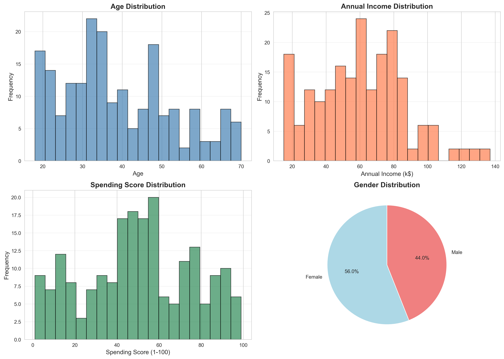
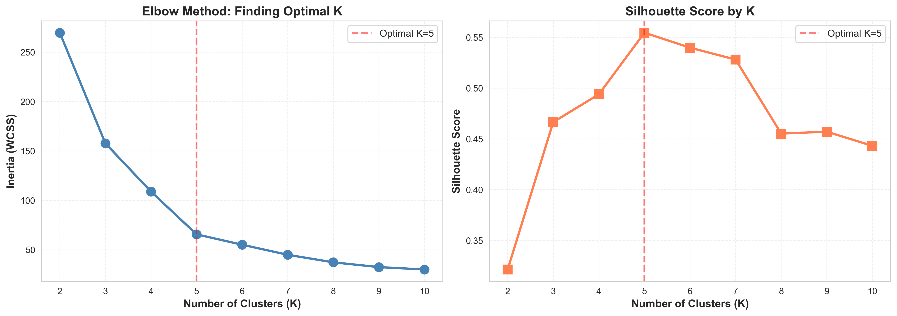
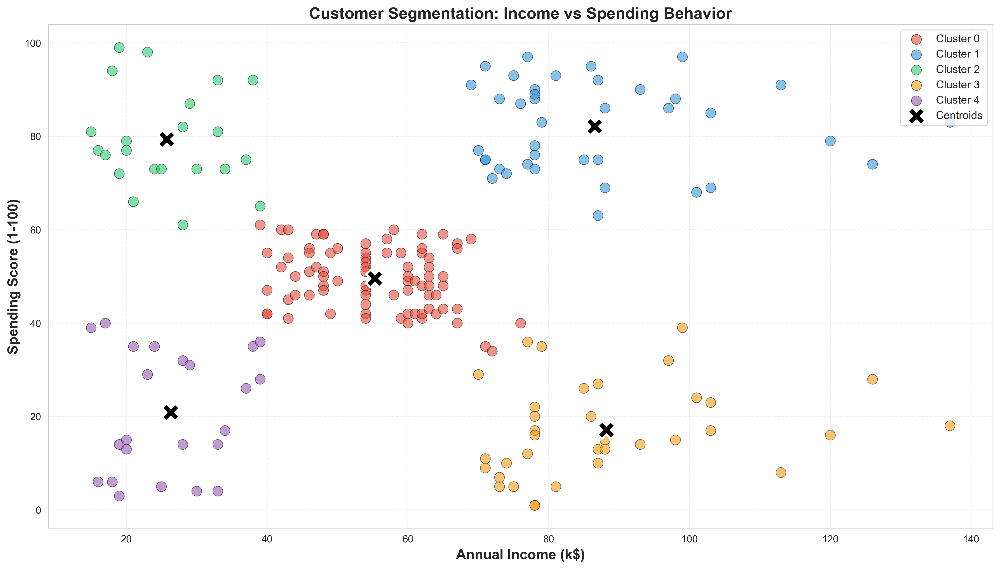
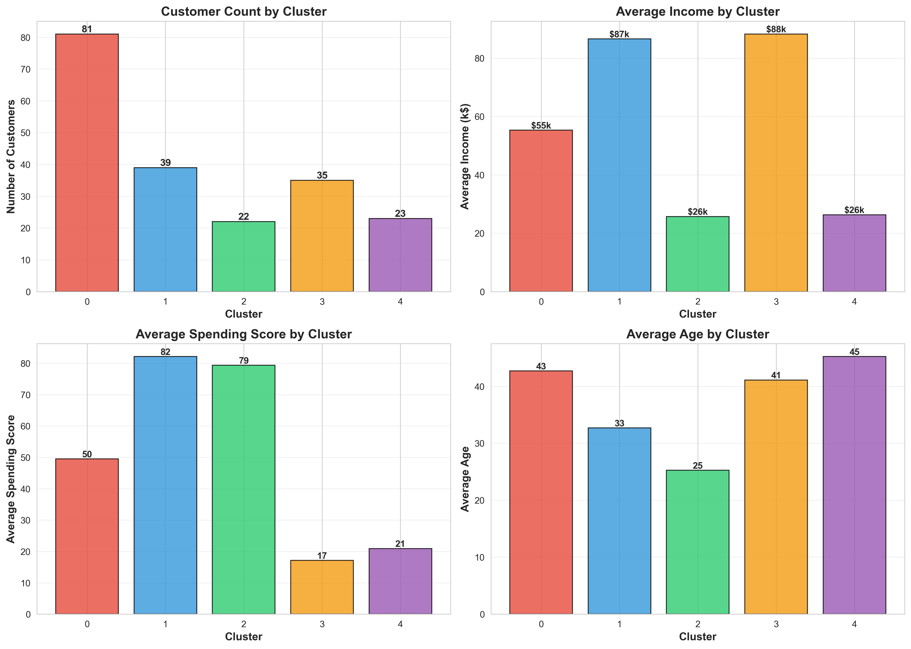
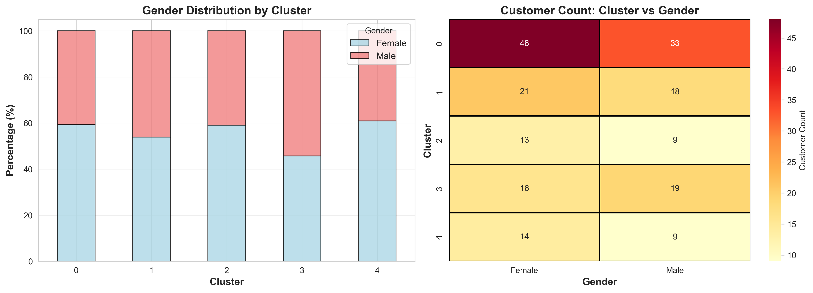

# Customer Segmentation Using K-means Clustering

## 🎯 Project Overview

I applied unsupervised machine learning to segment retail customers into distinct behavioral 
groups based on their income and spending patterns. This project demonstrates how clustering 
techniques can transform raw customer data into actionable business intelligence, enabling 
targeted marketing strategies and resource optimization.

## 📊 Key Results

### Segmentation Summary
- **Total customers analyzed:** 200
- **Optimal clusters identified:** 5 (determined via Elbow Method and Silhouette Score)
- **Features used:** Annual Income (k$) and Spending Score (1-100)

### Five Distinct Customer Segments

**Cluster 0: Careful Spenders (40.5% - 81 customers)**
- Average Income: ~$55k
- Average Spending Score: ~49/100
- Characteristics: Conservative spending habits despite moderate income
- Strategy: Value propositions, budget-friendly options, promotions

**Cluster 1: Target Customers (19.5% - 39 customers)**
- Average Income: ~$26k
- Average Spending Score: ~79/100
- Characteristics: High spending despite lower income (potential credit users)
- Strategy: Payment plans, credit offers, volume discounts, loyalty rewards

**Cluster 2: Standard Customers (11% - 22 customers)**
- Average Income: ~$55k
- Average Spending Score: ~50/100
- Characteristics: Average income with moderate spending patterns
- Strategy: Balanced product mix, standard marketing approaches

**Cluster 3: High Earners, Low Spenders (17.5% - 35 customers)**
- Average Income: ~$86k
- Average Spending Score: ~17/100
- Characteristics: Wealthy but cautious spenders (savers/investors)
- Strategy: Investment products, exclusive deals, quality over quantity messaging

**Cluster 4: VIP Customers (11.5% - 23 customers)**
- Average Income: ~$87k
- Average Spending Score: ~82/100
- Characteristics: High income with high spending (most valuable segment)
- Strategy: Premium offerings, VIP loyalty programs, personalized service

## 💡 Key Insights

### 1. The 40/20 Split
The largest segment (40.5%) consists of careful spenders who require value-driven messaging, 
while the highest-spending groups (Clusters 1 and 4) combined represent only 31% but likely 
generate disproportionate revenue. This suggests resource allocation should balance volume 
(Cluster 0) with value (Clusters 1 and 4).

### 2. Income Doesn't Equal Spending
I discovered that income alone doesn't predict spending behavior. Cluster 1 customers earn 
~$26k but score 79/100 on spending, while Cluster 3 customers earn ~$86k yet score only 17/100. 
This demonstrates why segmentation beyond demographics is critical—behavioral patterns matter 
more than income brackets.

### 3. Actionable Targeting Opportunities
- **23 VIP customers** represent immediate premium upsell opportunities
- **39 Target customers** show strong purchasing intent despite limited income—ideal for 
  credit programs or payment plans
- **35 High Earners with low spending** represent untapped potential—requires different 
  value proposition focused on quality/exclusivity rather than deals

### 4. Connection to Process Optimization
This segmentation work mirrors my warehouse optimization experience (15% efficiency improvement). 
In both cases, I analyzed existing patterns, identified distinct groups with different needs, 
and recommended targeted interventions rather than one-size-fits-all approaches. Data-driven 
segmentation improves resource allocation whether optimizing inventory flows or marketing spend.

## 🔧 Technical Approach

### Data Preparation
- Dataset: 200 retail customers with demographic and behavioral data
- Features selected: Annual Income and Spending Score (most relevant for behavioral segmentation)
- Standardization: Applied StandardScaler to normalize features for K-means distance calculations

### Determining Optimal K
I used two methods to identify the optimal number of clusters:

1. **Elbow Method**: Plotted Within-Cluster Sum of Squares (WCSS/Inertia) vs K
   - Clear elbow at K=5, indicating diminishing returns beyond this point
   
2. **Silhouette Score**: Measured cluster cohesion and separation
   - K=5 provided strong silhouette score indicating well-defined, distinct clusters

### K-means Algorithm
- Algorithm: K-means clustering (unsupervised learning)
- K value: 5 clusters
- Initialization: Random state fixed for reproducibility
- Convergence: Standard K-means iterative optimization

## 📈 Visualizations

### Customer Distribution Analysis

I analyzed the underlying data distributions before clustering. The income distribution shows 
bimodal characteristics (two peaks), suggesting natural groupings exist. Spending scores show 
more uniform distribution, indicating diverse spending behaviors across income levels.

### Optimal Cluster Analysis

The Elbow Method clearly shows the "elbow" at K=5, where additional clusters provide minimal 
improvement in WCSS. The Silhouette Score confirms K=5 provides good cluster separation and 
cohesion. These two methods together validate the choice of 5 segments.

### Customer Segmentation Map

This is the core visualization showing how customers segment by income and spending behavior. 
The five distinct clusters are clearly separated, with black X markers indicating cluster 
centroids (centers). This map immediately reveals:
- High income doesn't guarantee high spending (Cluster 3 vs Cluster 4)
- Some low-income customers are heavy spenders (Cluster 1)
- The largest group occupies the middle ground (Cluster 0)

### Cluster Profile Analysis

Detailed breakdown of each segment's characteristics. Cluster 0 dominates in size (81 customers), 
while Clusters 3 and 4 show similar high incomes (~$86-87k) but drastically different spending 
behaviors. This proves that demographic data alone (income, age) is insufficient—behavioral 
metrics (spending score) are essential for accurate segmentation.

### Gender Distribution by Cluster

Gender distribution varies by cluster, providing additional targeting insights. Some segments 
skew more heavily toward one gender, which could inform product selection and marketing messaging 
for each segment.

## 🛠️ Tools & Technologies

- **Python 3.x** - Core programming language
- **Pandas** - Data manipulation and analysis
- **NumPy** - Numerical computations
- **Scikit-learn** - K-means implementation, StandardScaler, evaluation metrics
- **Matplotlib & Seaborn** - Data visualization
- **Jupyter Notebook** - Interactive development environment

## 📁 Data Source

**Dataset:** Mall Customers Segmentation  
**Source:** Kaggle  
**Records:** 200 customers  
**Features:** CustomerID, Gender, Age, Annual Income, Spending Score  

## 🎓 What I Learned

### Technical Skills
- Unsupervised learning algorithms (K-means clustering)
- Feature standardization and its importance for distance-based algorithms
- Cluster validation techniques (Elbow Method, Silhouette Score)
- Translating clustering results into business insights

### Domain Understanding
- Income doesn't directly correlate with spending behavior
- Behavioral segmentation reveals patterns demographics alone miss
- Different customer segments require fundamentally different approaches
- Small high-value segments can be more profitable than large moderate segments

### Practical Applications
This segmentation approach applies beyond retail:
- **Energy sector (E.ON):** Segment customers by usage patterns (high/low consumption, 
  peak/off-peak users) to optimize tariff structures and demand management
- **Logistics:** Group delivery routes by density/distance patterns for efficiency
- **Manufacturing:** Segment production lines by performance characteristics for targeted 
  maintenance strategies

The analytical framework—identify patterns, group by behavior, tailor interventions—transfers 
across domains. I applied similar thinking when optimizing warehouse operations (15% improvement) 
by grouping workflows and implementing targeted process changes.

## 🚀 Future Improvements

Given more time, I would:

1. **Add temporal analysis** - Track how customers move between segments over time
2. **Incorporate additional features** - Include purchase frequency, product categories, 
   time-since-last-purchase for richer segmentation
3. **Try hierarchical clustering** - Compare results with different clustering algorithms 
   to validate findings
4. **Build predictive model** - Classify new customers into segments upon registration
5. **Calculate segment profitability** - Weight segments by actual revenue contribution, 
   not just size
6. **A/B test marketing strategies** - Validate recommended approaches for each segment with 
   real campaigns
7. **Create interactive dashboard** - Allow business users to explore segments dynamically and 
   filter by characteristics

## 📧 Contact

**GitHub:** github.com/NoIDontKnow  

---

*This project demonstrates practical application of unsupervised learning to customer analytics, 
providing data-driven segmentation that enables targeted marketing and resource optimization. 
The analytical approach connects to my broader interest in using data science to improve 
operational efficiency and decision-making across different domains.*
